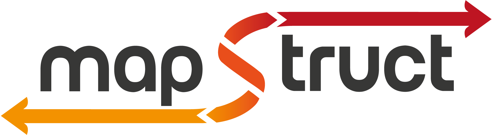
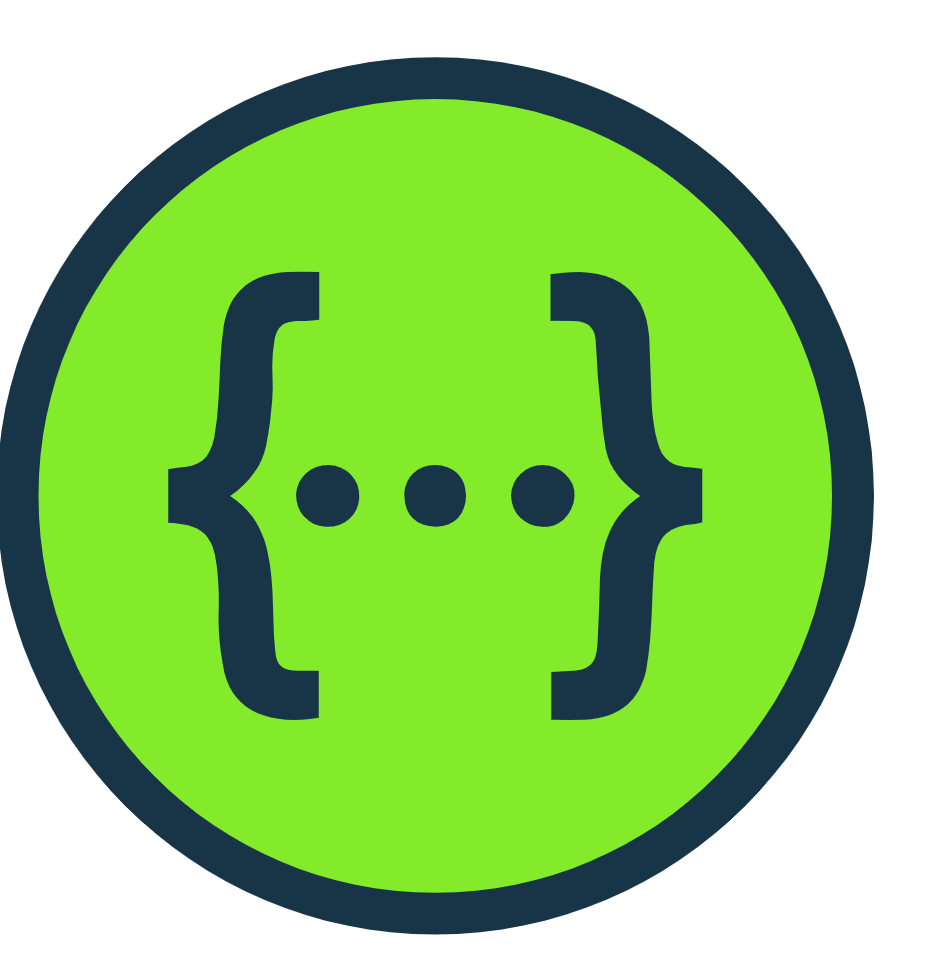

<!-- PROJECT LOGO -->
 

  

<h3 align="center">Серверная часть для платформы по перепродаже вещей  </h3>

  

    Командная работа для обработки запросов с фронтенда
     
    <a href="https://skyengpublic.notion.site/47bcac1b049f4af6b351e2ab5d05afb4"><strong>ТЗ проекта »</strong></a>
  

<!-- ABOUT THE PROJECT -->
## О проекте
Данный проект был создан разработчиками:
* Тарасенко Мария
* Васильев Илья

В данном проекте мы использовали все полученные знания для создание бэк сервиса продажи вещей. В ходе выполнения так же был изучен новыйе технологии такие как Spring Security и MapStruct.
### Сделан на

В данном блоке представленны технологии разработки использованные в проекте.

*  

*  

*  

*  

*  

<!-- CONTACT -->
## Контакты

* Васильев Илья(Лидер) - [@V_IllI_e](https://t.me/V_IllI_e) - pilaroiding@gmail.com
* Тарасенко Мария - link...

Project Link: [Avito](https://github.com/V4si1iy/Graduate-work-Avito)

(<a href="#readme-top">back to top</a>)

