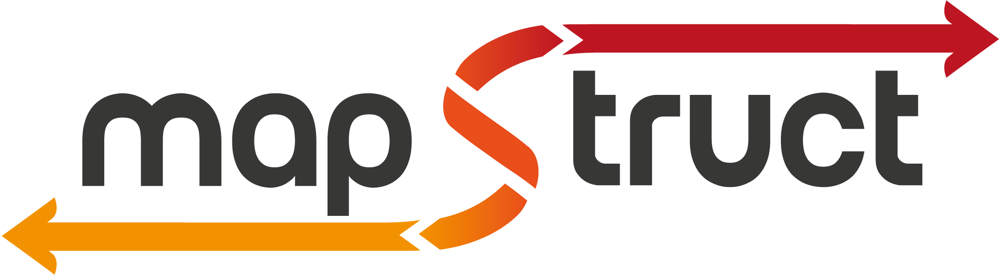

<!-- PROJECT LOGO -->
 

  

<h3 align="center">Серверная часть для платформы по перепродаже вещей  </h3>

  

    Работа для обработки запросов с фронтенда
     

  

<!-- ABOUT THE PROJECT -->
## О проекте
Данный проект был создан разработчиком:
* Васильев Илья

В данном проекте использовал все полученные знания для создание бэк сервиса продажи вещей. В ходе выполнения так же был изучены новые технологии, такие как Spring Security и MapStruct.
### Сделан на

В данном блоке представленны технологии разработки использованные в проекте.

*  

*  

*  

*  

*  

<!-- CONTACT -->
## Контакты

* Васильев Илья - [@V_IllI_e](https://t.me/V_IllI_e) - pilaroiding@gmail.com - [V4s1l1y](https://github.com/V4si1iy) 

Project Link: [Avito](https://github.com/V4si1iy/Graduate-work-Avito)

(<a href="#readme-top">back to top</a>)

